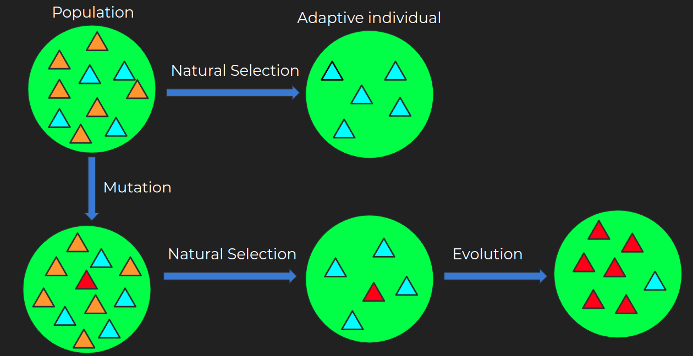
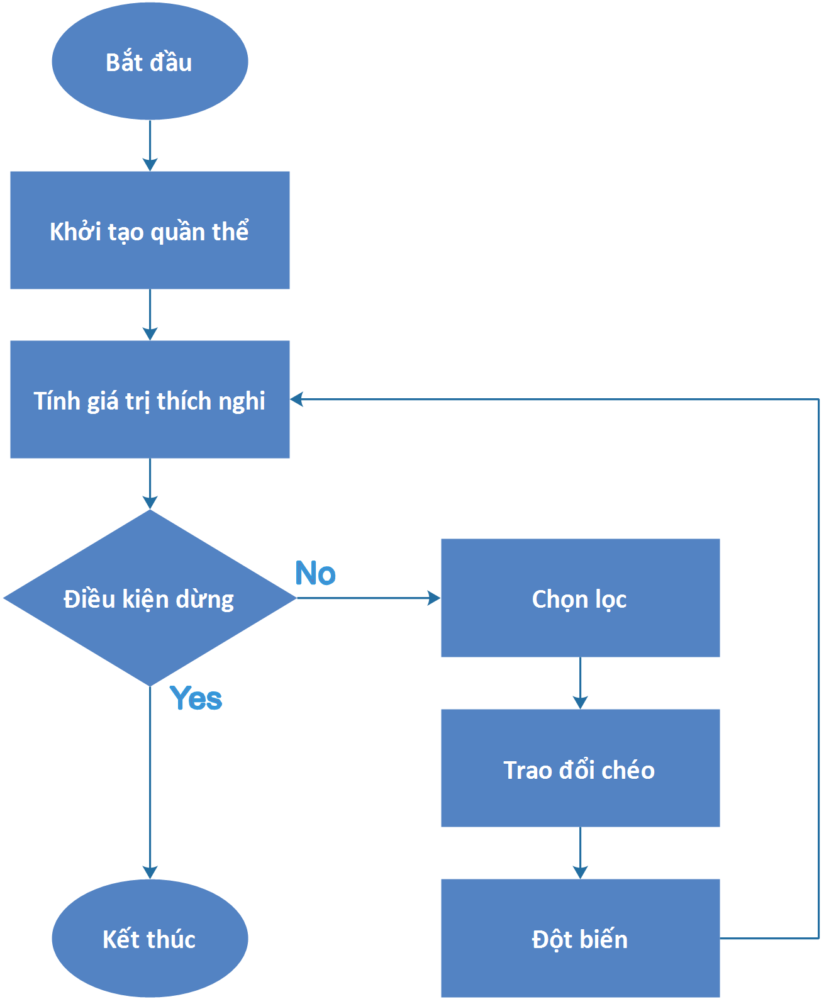
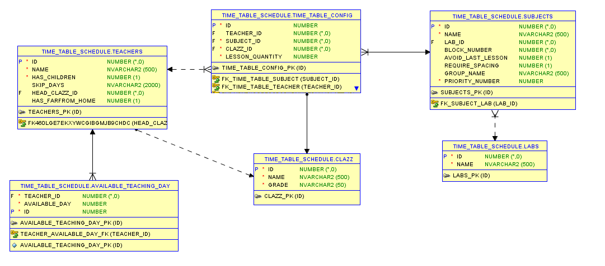
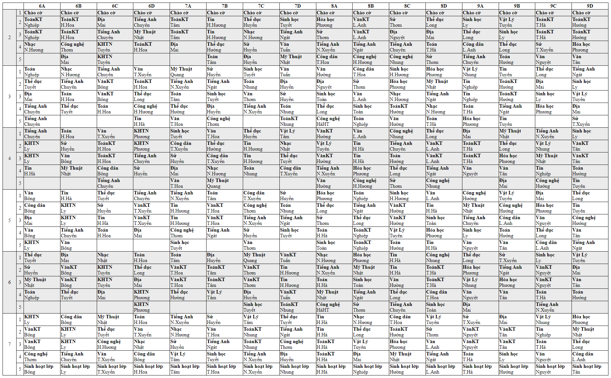
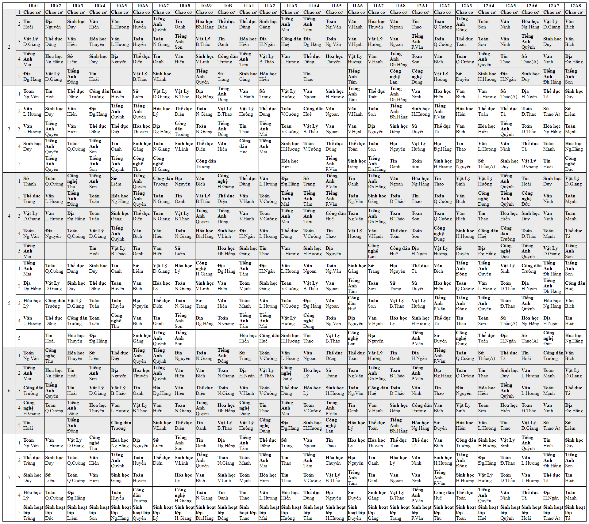

# SẮP XẾP THỜI KHÓA BIỂU CHO TRƯỜNG HỌC SỬ DỤNG THUẬT TOÁN DI TRUYỀN

## 1. Abstract

Bài toán xếp lịch biểu nói chung (như xếp lịch dự án, xếp lịch làm việc, thi đấu, ...) là một bài toán hay gặp trong đời sống.
Đối với loại bài toán này cần phải tìm ra một phương án xếp lịch thỏa mãn tất cả các ràng buộc cũng như khai thác hiệu quả các nguồn tài nguyên hiện có, giảm thời gian và chi phí thực hiện.
Bài toán xếp thời khóa biểu là một trong các bài toán như vậy.

Nghiên cứu này trình bày thuật toán di truyền dưới dạng biến thể để áp dụng vào giải quyết bài toán xếp lịch thời khóa biểu cho các trường học thuộc hệ phổ thông 3 cấp bao gồm Tiểu học, Trung học Cơ sở, Trung học phổ thông với một số ràng buộc cơ bản được thỏa mãn ở mức tốt nhất có thể.

## 2. Introduction

Có rất nhiều các ràng buộc ñược ñặt ra trong bài toán này như ràng buộc về đối tượng tham gia (giảng viên, lớp học, sinh viên), ràng 
buộc về tài nguyên phục vụ giảng dạy (phòng học lý thuyết, phòng thực hành,…), ràng buộc về thời gian (số tiết học, số lần học, số tiết mỗi lần), 
ràng buộc về chuyên môn và rất nhiều các ràng buộc khác tùy thuộc vào từng trường. 
Vấn đề đặt ra là cần xây dựng một thời khóa biểu thỏa mãn tất cả các ràng buộc trên đồng thời khai thác hiệu quả các nguồn tài nguyên phục vụ giảng dạy.

Bài toán xếp thời khóa biểu thuộc lớp các bài toán [NP-đầy đủ (NP-completeness)](https://vi.wikipedia.org/wiki/NP-%C4%91%E1%BA%A7y_%C4%91%E1%BB%A7) vì vậy có thể không tìm ra được lời giải tối ưu.
Đây là một bài toán không mới và đã có nhiều giải thuật được đưa ra để giải quyết như giải thuật nhánh cận, giải thuật leo ñồi, giải thuật luyện thép, giải thuật tô màu ñồ thị, giải thuật xấp xỉ,… 
Tuy nhiên các giải thuật này thường không có tính tổng quát và chỉ áp dụng hiệu quả đối với các trường học có quy mô nhỏ, ít ràng buộc về mặt dữ liệu.

Trong những năm gần đây, phương pháp tiếp cận di truyền đã thu hút rất nhiều sự chú ý trong các lĩnh vực nghiên cứu khác nhau trong đó có khoa học máy tính. 
Phương pháp này có nhiều đặc điểm nổi trội như không đòi hỏi tri thức, tránh tối ưu cục bộ, thực hiện tốt với các bài toán có không gian lời giải lớn và có thể áp dụng cho nhiều loại bài toán tối ưu khác nhau. 
Trên thế giới hiện nay, giải thuật di truyền kết hợp với tin học được ứng dụng ñể giải quyết những bài toán tối ưu một cách rất hiệu quả. 
Vì vậy, việc nghiên cứu và ứng dụng giải thuật di truyền (Genetic Algorithm - GA) để giải quyết hiệu quả bài toán xếp thời khóa biểu nói trên là việc làm cần thiết.

## 3. Genetic algorithm

Thuật toán di truyền lấy ý tưởng từ việc di truyền trong sinh học. Các đối tượng và từ khóa xoay quanh bài toán cũng giống như trong sinh học bao gồm `quần thể`, `chọn lọc`, `đột biến`, `sinh sản`, `nhiễm sắc thể`, ...



- **Population - Quần thể** : Một quần thể ban đầu sẽ có những cá thể nhất định với những đặc tính khác nhau, những đặc tính này sẽ quy định khả năng sinh sản, sinh tồn, khả năng đáp ứng điều kiện môi trường của từng cá thể.

- **Natural Selection - Chọn lọc tự nhiên** : Theo thời gian những cá thể yếu hơn, không có khả năng sinh tồn sẽ bị loại bỏ bởi những tác nhân như tranh chấp chuỗi thức ăn, môi trường tác độc, bị loài khác tiêu diệt, … Cuối cùng sẽ còn lại những cá thể có đặc tính ưu việt hơn sẽ được giữ lại - Adaptive individual.

- **Mutation - Đột biến** : Như chúng ta đã biết thì mỗi cá thể con được sinh ra sẽ được kế thừa lại những đặc tính của cả cha và mẹ. Sau một thời gian sinh sống, một quần thể sẽ đặt tới giới hạn của các cặp gen của con được tạo nên từ gen của bố mẹ. Để đạt được tới sự tiến hóa, Đột Biến chính là một trong những nguyên nhân chính, có vai trò đóng góp nguyên liệu cho quá trình Chọn lọc tự nhiên.

- **Evolution - Tiến hóa** : Những cá thể đột biến không phải luôn là những cá thể mạnh mẽ và có đủ khả năng sinh tồn, Chọn lọc tự nhiên sẽ chọn ra những cá thể đột biến nhưng có thể thích nghi với môi trường sống tốt hơn những cá thể khác trong quần thể. Sau một thời gian sinh sản, những gen đột biến sẽ chiếm ưu thế và chiếm đa số trong quần thể.


Từ các khái niệm này và quy trình tiến hóa trong sinh học, ta có thuật toán di truyền được mô tả sơ bộ như sau:

```
1.  Generation <-- 0;
2.  Initialize M(Generation);
3.  Evaluate M(Generation);
4.  Loop (until termination condition)
5.      Generation <-- Generation + 1;
6.      Select M(Generation) from M(Generation  - 1);
7.      Crossover M(Generation);
8.      Mutate M(Generation); 
9.      Evaluate M(Generation);
10. Loop End;
```

Hoặc sơ đồ khối như sau:



Giải thuật sẽ được thực hiện qua các bước sau:

- **Khởi tạo quần thể - Initialize population**: Sinh ra ngẫu nhiên một quần thể gồm n cá thể (trong đó n là lời giải cho bài toán).

- **Tính giá trị thích nghi - Evaluate**: Ước lượng độ thích nghi của mỗi cá thể.

- **Điều kiện dừng**: Kiểm tra điều kiện để kết thúc giải thuật.

- **Chọn lọc - Selection**: Chọn hai cá thể bố mẹ từ quần thể cũ theo độ thích nghi của chúng (cá thể có độ thích nghi càng cao thì càng có nhiều khả năng được chọn).

- **Lai ghép (Trao đổi chéo) - Cross over**: Với một xác suất được chọn, trao đổi chéo hai cá thể bố mẹ để tạo ra một cá thể mới.

- **Đột biến - Mutation**: Với một xác suất đột biến được chọn, biến đổi cá thể mới.

- **Chọn kết quả**: Nếu thỏa mãn điều kiện dừng thì giải thuật kết thúc và chọn được lời giải tốt nhất trong quần thể hiện tại.

Điều kiện dừng của GA dựa vào một hàm chi phí (cost function) tính toán điểm (độ vượt trội) của quần thể và so sánh với quần thể trước, hoặc khi việc chọn lọc, lai ghép, đột biến đạt tới thế hệ mong muốn, thì thuật toán sẽ dừng lại. 

## 4. Implementation

Áp dụng thuật toán di truyền vào giải bài toán xếp thời khóa biểu, trước hết, ta cần định nghĩa bài toán cụ thể. Các đối tượng xoay quanh bài toán bao gồm `môn học`, `giáo viên`, `lớp`, `thứ`, `tiết`, `phòng thực hành`.

Đầu vào của bài toán bao gồm danh sách giáo viên đăng ký dạy, danh sách các môn học giảng dạy trong trường, danh sách các lớp học trong kỳ học sắp tới và phân công 1 giáo viên dạy môn nào đó ở lớp nhất định với thời lượng được quy định sẵn.
Cấu trúc bảng và dữ liệu mẫu được để ở [thư mục db](./db). Lược đồ quan hệ các bảng được thể hiện như sau



Các ràng buộc có trong nghiên cứu:
- Cố định số tiết học của môn trong tuần và trong kỳ
- Không trùng tiết của giáo viên
- Các môn được cấu hình không học tiết cuối (như Thể dục) thì không cho học tiết cuối (trường `avoidLastLesson` của class [`Subject`](./src/main/java/com/github/truongbb/timetableschedule/entity/Subject.java))
- Trong tuần có một ngày có 2 tiết Văn/Toán liên tiếp để làm bài kiểm tra (trường `blockNumber` của class [`Subject`](./src/main/java/com/github/truongbb/timetableschedule/entity/Subject.java))
- Phân bố đều các môn, ví dụ môn Địa 1 tuần có 2 tiết sẽ có cách ngày, tránh học chung 1 ngày hoặc 2 ngày liền nhau (trường `requireSpacing` của class [`Subject`](./src/main/java/com/github/truongbb/timetableschedule/entity/Subject.java))
- Giảng viên thuê ngoài chỉ dạy được một vài ngày cố định trong tuần (class [AvailableTeachingDay](./src/main/java/com/github/truongbb/timetableschedule/entity/AvailableTeachingDay.java))
- Ưu tiên giáo viên nhà xa, có con nhỏ tránh dạy tiết 1 (trường `hasFarfromHome` và `hasChildren` của class [`Teacher`](./src/main/java/com/github/truongbb/timetableschedule/entity/Teacher.java))
- Các tiết nghỉ cấu hình vào ngày nhất định hoặc không cấu hình (sẽ rơi vào tiết cuối của các ngày)

Hệ thống cung cấp web hiển thị kết quả sau khi nhận đầu vào từ DB và áp dụng GA, cũng như cung cấp [API](./src/main/java/com/github/truongbb/timetableschedule/controller/TimeTableController.java) để hệ thống bên ngoài có thể gọi.

Thời khóa biểu cấp 2




Thời khóa biểu cấp 3



<details>
  <summary>Đầu vào khi gọi API</summary>

```js
{
    "teachers": [
        {
            "id": 1,
            "name": "Trùng",
            "hasChildren": true, // có con nhỏ
            "skipDays": null,
            "headClazz": { // chủ nhiệm lớp nào
                "id": 1,
                "name": "10A1",
                "grade": "10"
            },
            "hasFarfromHome": false // nhà xa
        }
        // danh sách giáo viên
    ],
        "subjects": [
        {
            "id": 1,
            "name": "Toán",
            "laboratory": null, // phòng thực hành
            "blockNumber": 2, // môn học liền nhau
            "avoidLastLesson": true, // tránh tiết cuối
            "requireSpacing": false, // học giãn cách không học 2 ngày liên tiếp
            "groupName": "Toán",
            "priorityNumber": 0
        }
        // danh sách môn học
    ],
        "clazzes": [
        {
            "id": 1,
            "name": "10A1",
            "grade": "10"
        }
        // danh sách lớp học
    ],
        "configTimeTable": [
        {
            "teacherId": 2, // giáo viên nào
            "subjectId": 1, // dạy môn nào
            "clazzId": 1, // cho lớp nào
            "lessonQuantity": 4 // số lượng tiết 1 tuần
        }
        // danh sách cấu hình giáo viên dạy môn gì cho lớp nào và bao nhiêu tiết 1 tuần
    ],
        "offLessonConfig": { // cấu hình tiết nghỉ vào ngày nào, tiết nào
        "10": [
            {
                "offDay": 3,// thứ mấy
                "offOrder": 4 // tiết mấy
            },
            {
                "offDay": 3,
                "offOrder": 5
            },
            {
                "offDay": 5,
                "offOrder": 5
            }
        ],
            "11": [
            {
                "offDay": 3,
                "offOrder": 5
            },
            {
                "offDay": 5,
                "offOrder": 5
            },
            {
                "offDay": 6,
                "offOrder": 5
            }
        ],
            "12": [
            {
                "offDay": 2,
                "offOrder": 5
            },
            {
                "offDay": 6,
                "offOrder": 5
            }
        ]
    },
    "availableTeachingDay": [ // cấu hình các ngày có thể dạy của giảng viên thuê ngoài
        {
            "teacherId": 1,
            "availableDay": 3
        },
        {
            "teacherId": 1,
            "availableDay": 5
        },
        {
            "teacherId": 7,
            "availableDay": 2
        },
        {
            "teacherId": 7,
            "availableDay": 4
        },
        {
            "teacherId": 7,
            "availableDay": 5
        }
    ]
}
```
</details>

## 5. Future work

Hiện tại, hệ thống đã xếp được thời khóa biểu đảm bảo các tiêu chí trên với độ tốt 80% (vẫn còn 1 số tiêu chí vi phạm nhỏ), vẫn cần NSD can thiệp thủ công sau khi thuật toán chạy xong.
Một số tiêu chí hệ thống chưa đạt được:
- Check trùng phòng máy thực hành
- Ưu tiên dồn tiết, tránh bị cơi giờ cho giáo viên (ví dụ không bị dạy tiết 1, 5, nghỉ tiết 2, 3, 4)
- Linh động tiết Sinh hoạt lớp do có thể giáo viên chủ nhiệm bận vào tiết cuối cùng của ngày thứ 7
- Tối đa tiết trống trong tuần cho giáo viên và đảm bảo liền mạch

Trong tương lai, hệ thống sẽ tiếp tục cải thiện và phát triển để hoàn thiện hơn.

<br/>
<br/>

## REFERENCES

[1] http://mit.dthu.edu.vn/uploads/TKHuong.pdf

[2] https://duyphamdata.blogspot.com/2017/11/genetic-algorithm-giai-thuat-di-truyen.html

[3] https://nerophung.github.io/2020/05/28/genetic-algorithm

[4] http://tailieuso.udn.vn/bitstream/TTHL_125/4097/2/Tomtat.pdf

[5] https://www.researchgate.net/publication/304862375_Giai_thuat_xep_thoi_khoa_bieu_ung_dung_vao_bai_toan_quan_ly_xep_lich_thi_ket_thuc_cac_lop_hoc_phan_tai_Truong_Dai_hoc_Can_Tho

[6] https://viblo.asia/p/thuat-toan-di-truyen-ung-dung-giai-mot-so-bai-toan-kinh-dien-phan-2-07LKXwYp5V4

[7] https://www.youtube.com/watch?v=nu3jQs9-1A4&ab_channel=Tr%E1%BA%A7nHo%C3%A0ngGiang
